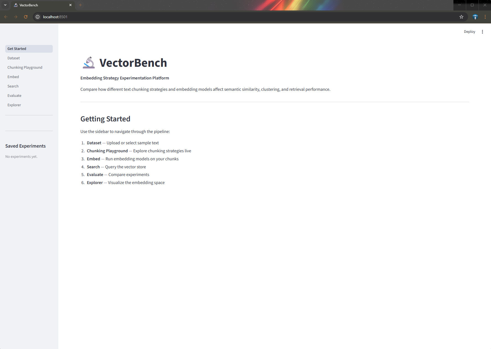
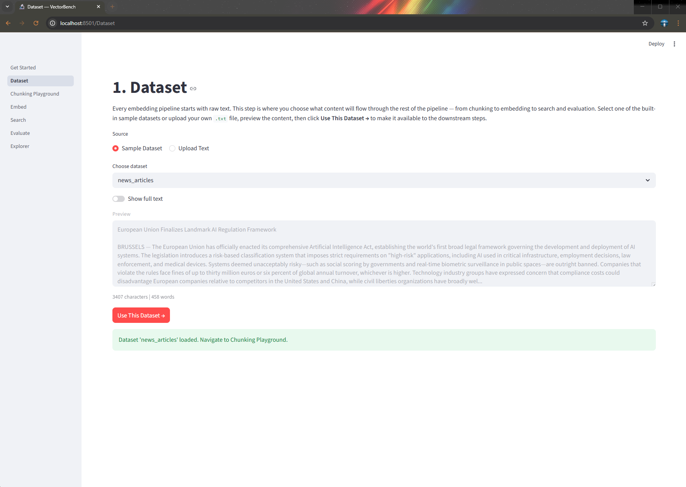
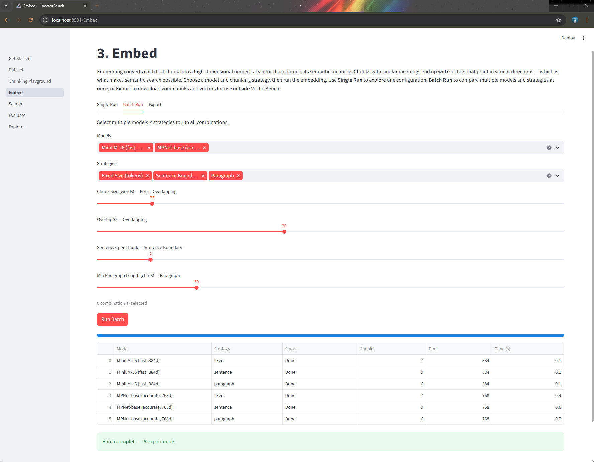
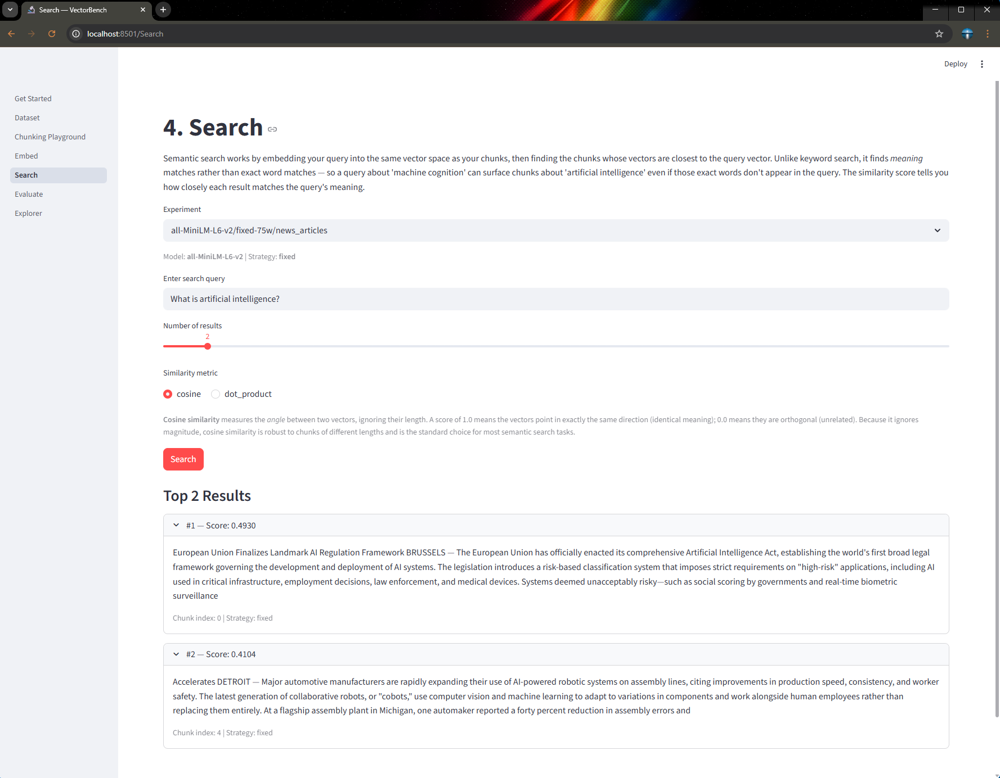
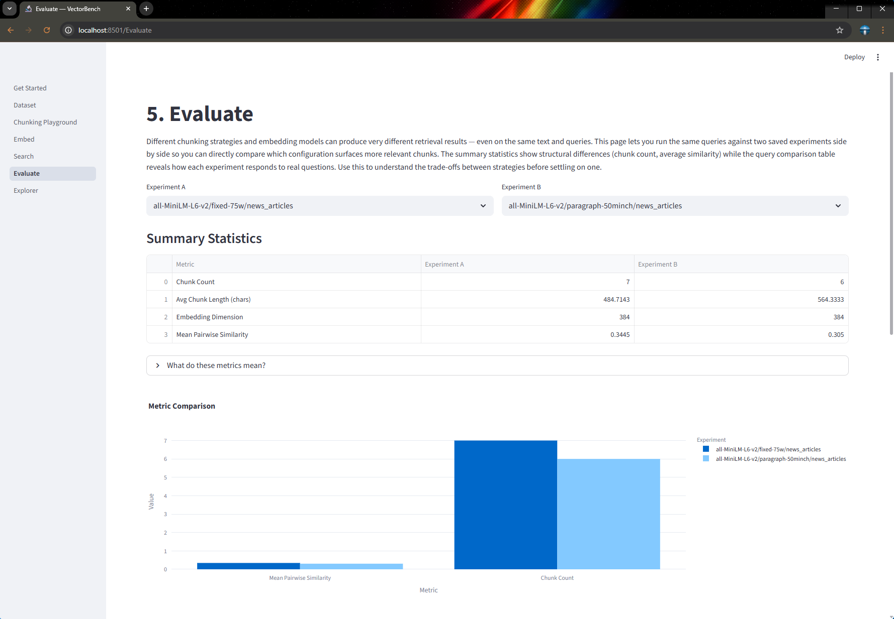
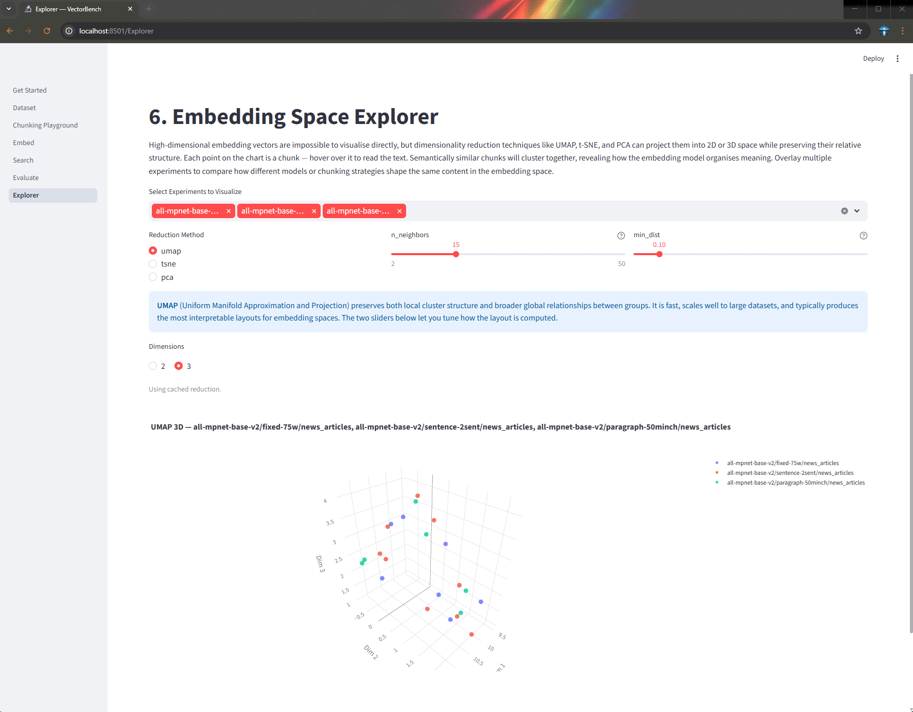
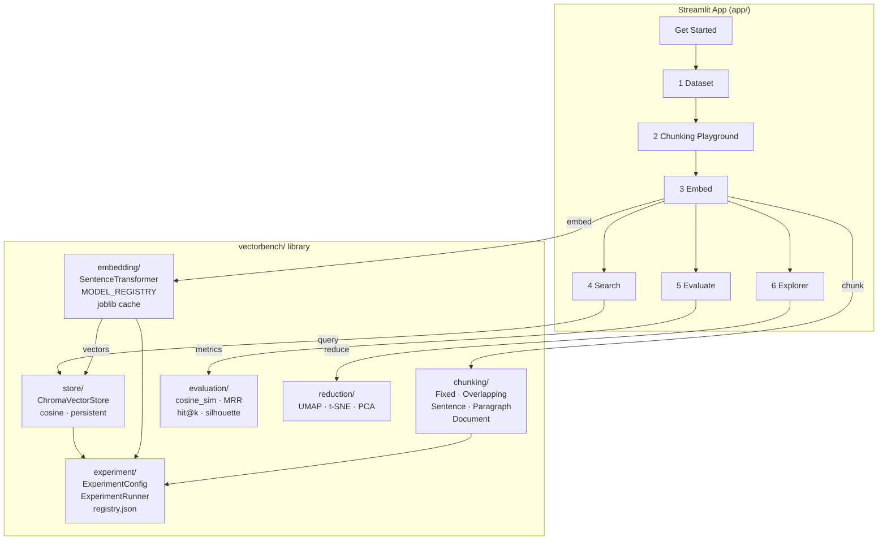

# VectorBench

**Embedding Strategy Experimentation Platform** — compare how different text chunking strategies and embedding models affect semantic similarity, clustering, and retrieval performance.

## Background

### Problem

While working on a separate project that required semantic search, I realised I didn't have the foundational knowledge to make informed decisions — which embedding model to use, how to chunk the source text, what similarity metric was appropriate, or how those choices would interact with each other. The concepts were unfamiliar enough that I couldn't evaluate trade-offs with confidence.

### Solution

I built VectorBench as a hands-on learning and experimentation tool. Rather than reading about chunking strategies and embedding models in the abstract, I could load real text, try different configurations, and immediately see the effects — how chunk boundaries fall, how embeddings cluster in space, how retrieval quality changes between strategies. The goal was to build genuine intuition before applying these techniques in a production context.

## Demo


## Screenshots

| | | |
|---|---|---|
|  |  |  |
| Get Started | Dataset | Embed |
|  |  |  |
| Search | Evaluate | Explorer |

---

## Quickstart

### Local

```bash
# Install (CPU-only)
pip install -e ".[dev]"
python -c "import nltk; nltk.download('punkt_tab')"

# Run
streamlit run app/Get_Started.py
```

Open http://localhost:8501

### Docker

```bash
docker-compose up --build
```

Open http://localhost:8501. Models are downloaded on first run and cached in a named Docker volume.

---

## Architecture



---

## Pipeline

```
Text → Chunker → Embedder → ChromaVectorStore
                                  ↓
                         Search · Evaluate · Explorer
```

State flows through `ExperimentConfig` (a dataclass) and is persisted across browser refreshes via ChromaDB (vectors) + `data/registry.json` (metadata).

---

## Pages

| Page | What it does |
|---|---|
| **Get Started** | Overview and navigation guide |
| **1 Dataset** | Select a sample text or upload your own `.txt` |
| **2 Chunking Playground** | Live sliders to explore chunking strategies with colored preview |
| **3 Embed** | Single run or batch (multiple models × strategies); export CSV/JSON |
| **4 Search** | Semantic search with selectable experiment, result count, and similarity metric |
| **5 Evaluate** | Side-by-side experiment comparison with summary bar chart |
| **6 Explorer** | Interactive UMAP/t-SNE/PCA scatter (2D or 3D) with hover text |

---

## Chunking Strategies

| Strategy | Description | Key params |
|---|---|---|
| `fixed` | Split on word count | `chunk_size` |
| `overlapping` | Sliding window | `chunk_size`, `overlap` |
| `sentence` | NLTK sentence boundaries | `sentences_per_chunk` |
| `paragraph` | Double-newline split | `min_length` |
| `document` | Whole document = 1 chunk | — |

## Embedding Models

| Model | Dim | Size |
|---|---|---|
| `all-MiniLM-L6-v2` | 384 | ~90 MB |
| `all-mpnet-base-v2` | 768 | ~420 MB |
| `paraphrase-MiniLM-L3-v2` | 384 | ~61 MB |
| `all-distilroberta-v1` | 768 | ~290 MB |

---

## Running Tests

```bash
pytest                        # all tests
pytest --cov=vectorbench      # with coverage
pytest tests/test_chunking.py # single module
```

Tests use `MockEmbedder` (returns random vectors, no model loading) and in-memory ChromaDB, so the full suite runs in ~4 seconds.

---

## Project Structure

```
vectorbench/
├── pyproject.toml
├── Dockerfile
├── docker-compose.yml
├── assets/                 # screenshots and demo GIF
├── vectorbench/
│   ├── chunking/           # 5 chunking strategies
│   ├── embedding/          # embedder wrapper, registry, joblib cache
│   ├── store/              # ChromaDB vector store
│   ├── evaluation/         # metrics, side-by-side comparison
│   ├── reduction/          # UMAP / t-SNE / PCA
│   ├── experiment/         # ExperimentConfig, ExperimentRunner, JSON registry
│   └── data/               # sample datasets + ground_truth.json
├── app/
│   ├── Get_Started.py      # landing page + sidebar experiment list
│   ├── state.py            # PipelineStage enum, typed session helpers
│   ├── components/         # chunk_preview, embedding_table, scatter_plot
│   └── pages/              # 6 Streamlit pages
└── tests/                  # unit tests
```

---

## Tech Stack

Python 3.11 · Streamlit · sentence-transformers · ChromaDB · Plotly · UMAP-learn · scikit-learn · joblib · NLTK
